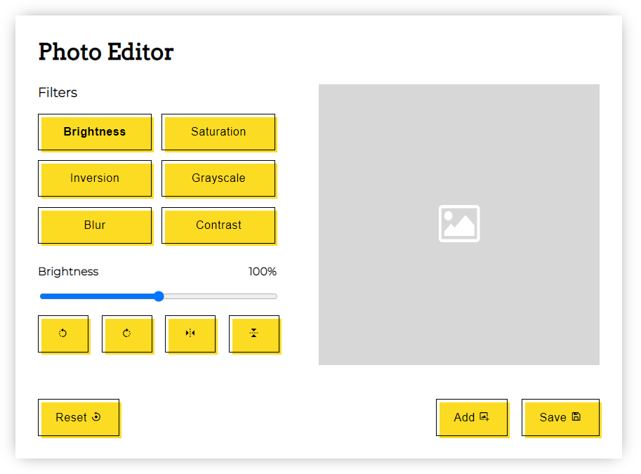

## Table of contents
* [General info](#general-info)
* [Technologies](#technologies)
* [Version](#version)
* [Screenshots](#screenshots)
* [Live](#live-star2)

## General info
Photo Editor written using Vanilla JavaScript.    
You can add your image and change it using available filters:
* brightness
* saturation
* inversion
* grayscale
* rotate:
    * left
    * right
* flip:
    * horizontal
    * vertical
* blur  
* contrast  

After editing the image, you can save it for yourself.

## Version
`1.0` - Photo Editor with 8 filters  
`1.1` - Photo Editor with 10 filters  
`1.2` - Added modal to inform about adding a photo before using filters

## Technologies
Project was created with:
* HTML5
* SCSS
* JavaScript
* Micromodal.js
* Boxicons

## Screenshots
* Important info before starting the app. If you run the app for the first time then you will see a modal telling you to add a photo before applying filters.    

* Desktop version :computer:     

* Mobile version :iphone:   

## Live :star2:
* https://goldipl.github.io/Photo-Editor/